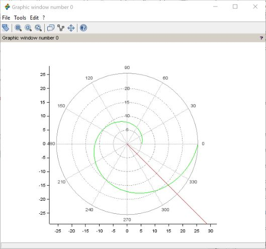

# Отчет по лабораторной работе №2
## Задача о погоне 
Выполнила: Пономарева Лилия Михайловна
НПИбд-02-19
___
# Цель работы
Получить навыки построения математических моделей для выбора правильной стратегии при решении задач поиска на примере задачи о погоне.
___
# Задача (вар. 44)
На море в тумане катер береговой охраны преследует лодку браконьеров.
Через определенный промежуток времени туман рассеивается, и лодка обнаруживается на расстоянии 16,3 км от катера. Затем лодка снова скрывается в тумане и уходит прямолинейно в неизвестном направлении. Известно, что скорость катера в 4,1 раза больше скорости браконьерской лодки.
Необходимо определить по какой траектории необходимо двигаться катеру, чтоб нагнать лодку.
___
# Дифференциальные уравнения
Решение исходной задачи сводится к решению дифференциального уравнения: 

$\frac{dr}{d\theta} = \frac{r}{\sqrt{15.81}}$
с начальными условиями $\begin{cases} \theta_0=0\\r_0=x_1 \end{cases}$ или $\begin{cases} \theta_0=-\pi\\r_0=x_2 \end{cases}$ 

 Решив это уравнение, мы получим траекторию движения катера в полярных координатах.
___
# Код в Scilab
Начальные данные
s=16.3;
fi=3*%pi/4;
function dr=f(theta,r)
  dr=r/sqrt(15.81)
  endfunction;
r0 = s/3.1;
theta0=0;
// 2 случай
r0 = s/5.1;
theta0=-%pi;
___
# Код в Scilab
theta=0:0.01:2*%pi;
r=ode(r0,theta0,theta,f);
function xt=f2(t)
xt=tan(fi)*t;
endfunction;
t=0:1:800;
polarplot(theta,r,style=color('green'));
plot2d(t,f2(t),style = color('red'));
___
# Результат для 1 случая

___
# Результат для 2 случая

___
# Точка пересечения (1)
.jpg) (14.8, 315$^\circ$)
___
# Точка пересечения (2)
.jpg) (19.8, 315$^\circ$)
___
# Вывод
Научились строить математические модели для выбора правильной стратегии при решении задач поиска на примере задачи о погоне. 