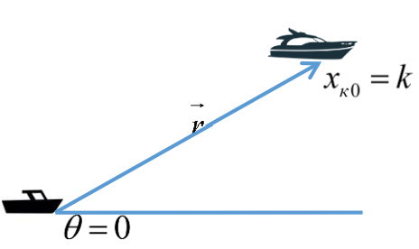
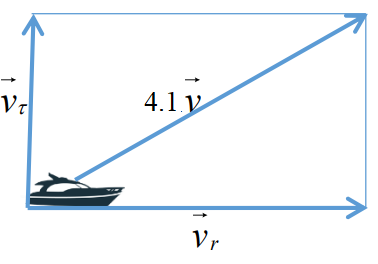
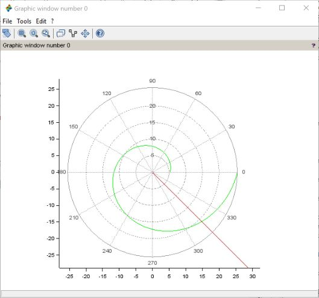
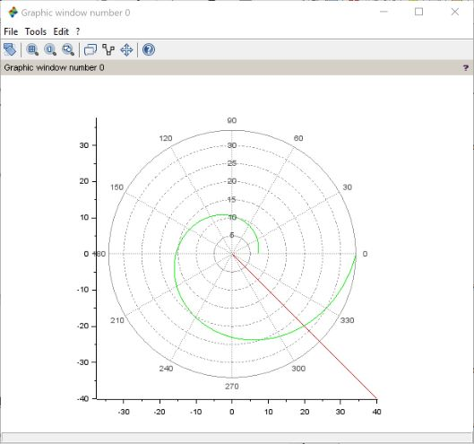

# Отчет по лабораторной работе №2

**Дисциплина: Математическое моделирование**

Студент: Пономарева Лилия Михайловна


## Цель работы 

Получить навыки построения математических моделей для выбора правильной стратегии при решении задач поиска на примере задачи о погоне.

## Задание

_Вариант 44_

На море в тумане катер береговой охраны преследует лодку браконьеров.
Через определенный промежуток времени туман рассеивается, и лодка
обнаруживается на расстоянии 16,3 км от катера. Затем лодка снова скрывается в
тумане и уходит прямолинейно в неизвестном направлении. Известно, что скорость
катера в 4,1 раза больше скорости браконьерской лодки.

1. Запишите уравнение, описывающее движение катера, с начальными условиями для двух случаев (в зависимости от расположения катера относительно лодки в начальный момент времени). 
2. Постройте траекторию движения катера и лодки для двух случаев.
3. Найдите точку пересечения траектории катера и лодки 

## Теоретическое введение

1. Принимаем за $t_0=0$, $x_{л0}=0$ - место нахождения лодки браконьеров в момент обнаружения, $x_{к0}=k$ - место нахождения катера береговой охраны относительно лодки браконьеров в момент обнаружения лодки. 
2. Введем полярные координаты. Считаем, что полюс - это точка обнаружения лодки браконьеров $x_{л0}(\theta=x_{л0}=0)$, а полярная ось r проходит через точку нахождения катера береговой охраны (рис. 1).




3. Траектория катера должна быть такой, чтобы и катер, и лодка все время были на одном расстоянии от полюса $\theta$, только в этом случае траектория катера пересечется с траекторией лодки. Поэтому для начала катер береговой охраны должен двигаться некоторое время прямолинейно, пока не окажется на том же расстоянии от полюса, что и лодка браконьеров. После этого катер береговой охраны должен двигаться вокруг полюса удаляясь от него с той же скоростью, что и лодка браконьеров.
4. Чтобы найти расстояние x (расстояние после которого катер начнет двигаться вокруг полюса), необходимо составить простое уравнение. Пусть через время t катер и лодка окажутся на одном расстоянии x от полюса. За это время лодка пройдет x, а катер k-x(или k+x, в зависимости от начального положения катера относительно полюса). Время, за которое они пройдут это расстояние, вычисляется как $\frac{x}{v}$ или $\frac{k - x}{4.1v}$ (во втором случае $\frac{k + x}{4.1v}$). Так как время одно и то же, то эти величины одинаковы. Тогда неизвестное расстояние x можно найти из следующего уравнения: $$ \frac{x}{v} = \frac{k - x}{4.1v} $$ в первом случае или $$ \frac{x}{v} = \frac{k + x}{4.1v} $$ во втором. Отсюда мы найдем два значения: $$x_1 = \frac{k}{3.1}, x_2 = \frac{k}{5.1}$$ Задачу будем решать для двух случаев.
5. После того, как катер береговой охраны окажется на одном расстоянии от полюса, что и лодка, он должен сменить прямолинейную траекторию и начать двигаться вокруг полюса удаляясь от него со скоростью лодки $v$. Для этого скорость катера раскладываем на две составляющие: $v_\tau$ - тангенциальная скорость (рис. 2). Радиальная скорость - это скорость, с которой катер удаляется от полюса, $v_r=\frac{dr}{dt}$. Нам нужно, чтобы эта скорость была равна скорости лодки, поэтому полагаем $\frac{dr}{dt}=v$. Тангенциальная скорость – это линейная скорость вращения катера относительно полюса. Она равна произведению угловой скорости $\frac{d\theta}{dt}$ на радиус r, $v_\tau=r\frac{d\theta}{dt}$



Из рисунка видно: $v_\tau=\sqrt{16.81v^2 - v^2} = \sqrt{15.81}v$ (учитывая, что радиальная скорость равна $v$). Тогда получаем $r\frac{d\theta}{dt}= \sqrt{15.81}v$.
6. Решение исходной задачи сводится к решению системы из двух дифференциальных уравнений $$\begin{cases} \frac{dr}{dt}=v\\r\frac{d\theta}{dt}=\sqrt{15.81}v \end{cases}$$ с начальными условиями $$\begin{cases} \theta_0=0\\r_0=x_1 \end{cases}$$ или $$\begin{cases} \theta_0=-\pi\\r_0=x_2 \end{cases}$$ Исключая из полученной системы производную по t, можно перейти к следующему уравнению: $$\frac{dr}{d\theta} = \frac{r}{\sqrt{15.81}}.$$ Начальные условия остаются прежними. Решив это уравнение, мы получим траекторию движения катера в полярных координатах.

## Выполнение лабораторной работы

По теоретическим выкладкам приведенным выше построили траекторию движения катера и лодки для двух случаев.

*Код в Scilab*

``` 
s=16.3; // начальное расстояние от лодки до катера
fi=3*%pi/4;

//функция, описывающая движение катера береговой охраны 
function dr=f(theta,r)
  dr=r/sqrt(15.81)
  endfunction;

//начальные условия (случай 1)
r0 = s/3.1;
theta0=0;
theta=0:0.01:2*%pi;

//ode - программа решения обыкновенных дифференциальных уравнений
r=ode(r0,theta0,theta,f);

//функция, описывающая движение лодки браконьеров
function xt=f2(t)
  xt=tan(fi)*t;
  endfunction;
t=0:1:800;

//построение траектории движения катера в полярных координатах
polarplot(theta,r,style=color('green'));
//построение траектории движения лодки
plot2d(t,f2(t),style = color('red'));

//корректировка начальных условий для случая 2
theta0=-%pi;
r0 = s/5.1;
r=ode(r0,theta0,theta,f);
polarplot(theta,r,style=color('green'));
plot2d(t,f2(t),style = color('red'));
```

*Результат работы программы*







#### Определение по графику точки пересечения катера и лодки.

.jpg)

Точка пересечения в первом случае лежит в координатах (14.8, 315$^\circ$)

.jpg)

Точка пересечения во втором случае лежит в координатах (19.8, 315$^\circ$)


## Выводы

Научились строить математические модели для выбора правильной стратегии при решении задач поиска на примере задачи о погоне. 
